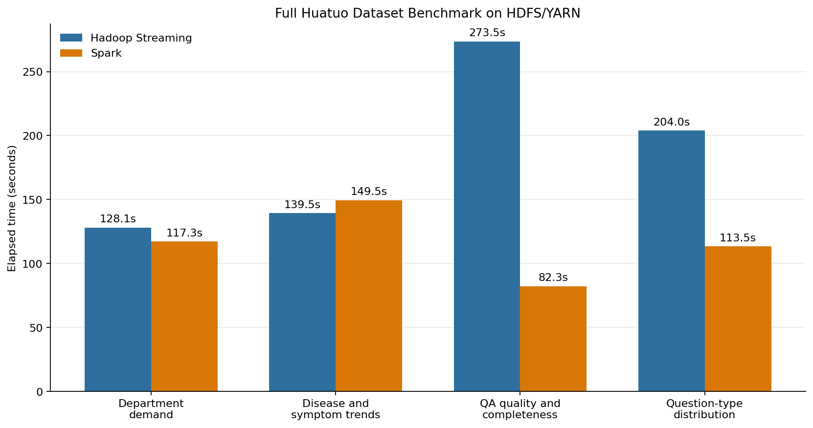

# Huatuo Big Data Processing

Large-scale Huatuo medical QA processing and comparative analytics using Hadoop
Streaming and Apache Spark.

This project standardizes four heterogeneous Huatuo medical question-answer
sources into one canonical JSONL dataset, uploads the prepared data to HDFS, and
runs equivalent Hadoop/Spark analytics on YARN.

## Highlights

- Original source data: **34,048,913 records**, **5.432 GB**.
- Final canonical dataset: **34,048,898 records**, about **19 GB**.
- Integration method: schema normalization and union, not joins.
- Processing frameworks: Hadoop Streaming and PySpark.
- Execution mode: HDFS/YARN.
- Case studies: department demand, disease/symptom trends, QA quality, and
  question-type distribution.

## Repository Structure

```text
config/          Shared analytical rules
data/samples/    Small tracked sample records
hadoop/          Hadoop Streaming mapper and reducer
preprocessing/   Download, standardization, union, validation, summaries
reports/         Integrity summaries, full-data summaries, benchmark chart
scripts/         Reproducible commands for data prep and execution
spark/           Equivalent PySpark analytics implementation
journey.md       Detailed project guide and benchmark evidence
```

Large source data, generated canonical datasets, local documents, virtual
environments, and job outputs are ignored by Git.

## Setup

```bash
python3 -m venv .venv
source .venv/bin/activate
.venv/bin/python -m pip install --upgrade pip
.venv/bin/python -m pip install -r requirements.txt
```

For an existing environment:

```bash
source .venv/bin/activate
```

## Data Pipeline

Inspect downloaded source data:

```bash
bash scripts/inspect_source_data.sh summary
bash scripts/inspect_source_data.sh samples
```

Create source integrity evidence:

```bash
bash scripts/create_source_manifest.sh
```

Create the deterministic 400,000-record pilot:

```bash
bash scripts/create_pilot.sh
bash scripts/prepare_data.sh data/pilot data/processed-pilot
```

Prepare the complete canonical dataset:

```bash
bash scripts/prepare_full_data.sh data/source data/standardized-full
```

Inspect the complete canonical dataset:

```bash
bash scripts/summarize_full_data.sh
```

## HDFS/YARN Execution

Start Hadoop services:

```bash
start-dfs.sh
start-yarn.sh
```

Upload the full canonical dataset to HDFS:

```bash
bash scripts/upload_to_hdfs.sh \
  data/standardized-full/huatuo_unified.jsonl \
  /healthcare/full/input
```

Run the full per-case-study benchmark:

```bash
bash scripts/run_full_case_benchmark.sh
```

Run only one framework or selected case studies:

```bash
bash scripts/run_full_case_benchmark.sh hadoop
bash scripts/run_full_case_benchmark.sh spark
bash scripts/run_full_case_benchmark.sh hadoop 3,4
```

## Benchmark Results

Full HDFS/YARN benchmark on the 34,048,898-record canonical dataset:



| Case study                  | Output groups | Hadoop Streaming on YARN | Spark on YARN |
| --------------------------- | ------------: | -----------------------: | ------------: |
| Department demand           |            16 |                128.071 s |     117.327 s |
| Disease and symptom trends  |         2,711 |                139.457 s |     149.503 s |
| QA quality and completeness |             4 |                273.549 s |      82.296 s |
| Question-type distribution  |             7 |                204.027 s |     113.497 s |

Regenerate the chart:

```bash
MPLCONFIGDIR=.matplotlib-cache \
  .venv/bin/python scripts/generate_benchmark_chart.py
```

## Evidence

Key tracked evidence files:

```text
reports/source_manifest.csv
reports/source_manifest.json
reports/pilot_summary.json
reports/framework_equivalence.json
reports/full_summary.json
reports/full_benchmark_chart.png
results/case-benchmark/timings-cluster-20260606-153149.csv
results/case-benchmark/timings-full-cluster-20260607-171724.csv
```

See [journey.md](journey.md) for the detailed methodology, canonical schema,
case-study definitions, full inspection results, and benchmark discussion.
